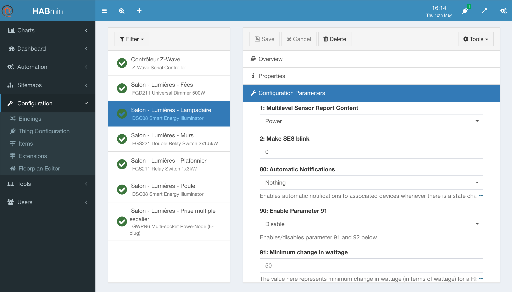
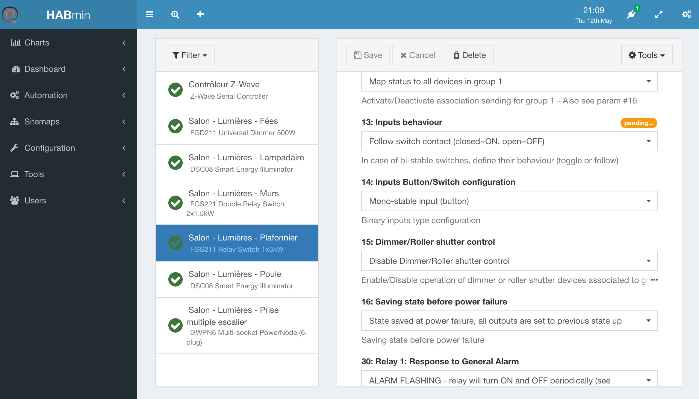
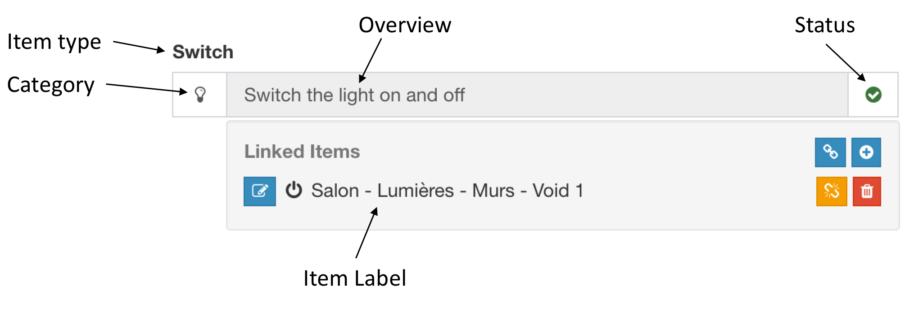

# Configuring a Thing
You can access to the Thing configuration by clicking on *Configuration*, *Thing Configuration* in the right menu.

The Thing configuration display has 6 panels.

## Overview configuration panel

This panel contains the following information:
* The label giving you the model name of the *Thing*, read-only,
* The overview, giving a description of the *Thing*, coming from the ZWave database, read-only,
* A set of controls, one per actionable *item* that has been created. You can play with the control in order to check that your device is correctly working. The name and the identifier of the *item* are read-only.

> 
The name of the item can be modified in the channels panel.

## The properties panel

The properties panel presents the Label of the Thing.

You can change the label making it more informative.

The change is saved as soon as you select the *Save* button at the top of the windows.

## Configuration parameters panel

This panel presents the configuration parameters of the device

The content of this panel depends on the device model.

The use of these parameters are described in the user's manual of the device itself.

When a parameter value is changed, Habmin send it to the device. A *pending* message is displayed  at this time.

## Association group panel

<<<< TO BE COMPLETED >>>>

## Device configuration panel

<<<< TO BE COMPLETED >>>>

## Channels panel

This panel is the key panel to configure the *Items*, as the channels are the link between *Things* and *Items*.

Basically, HABmin will create one *Item* per channel.

Each channel follows the same following structure:

Five buttons allow different actions:

HABmin 2 creates and link automatically the needed *items* when a *thing* is created, so creating, deleting and linking action are not often used.

To personnalise item information, the *edit linked data* button opens the following window:

This window allows to :
* change the label, making it more informative;
* modify the item type if needed;
* modify the category if needed.

The modification are saved as soon as you select the *Save* button.

