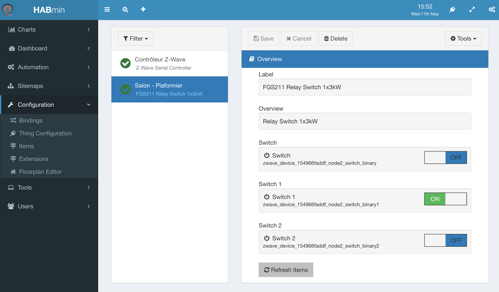
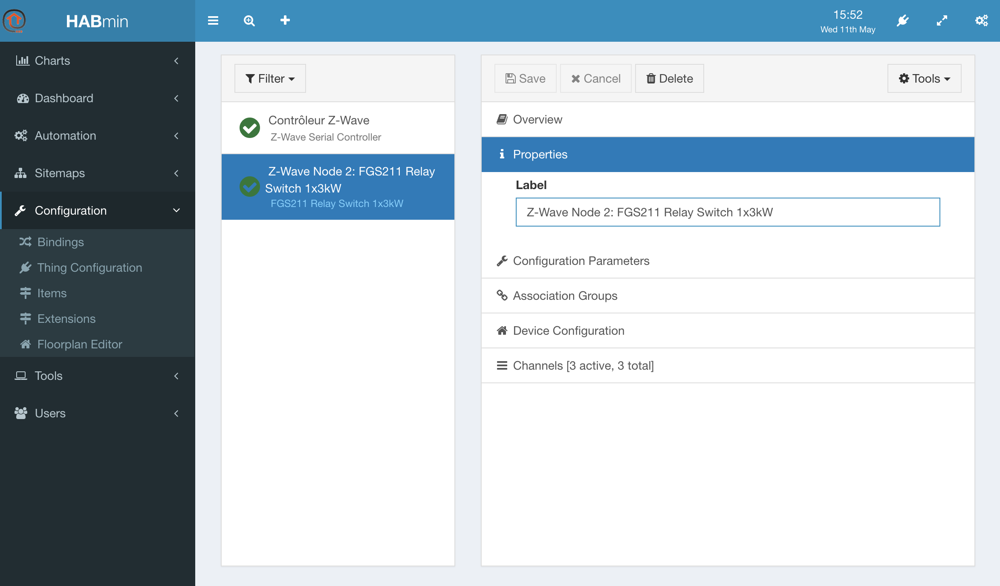
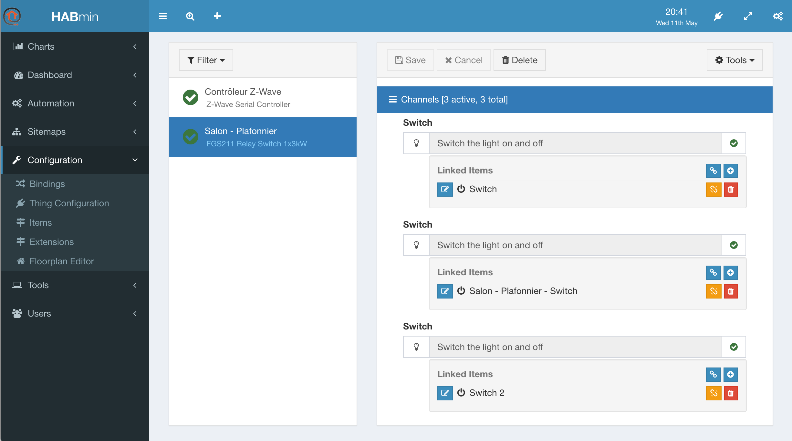
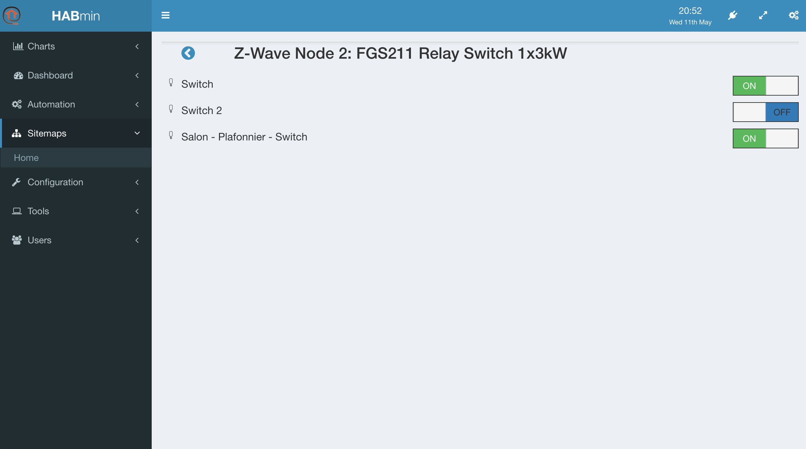
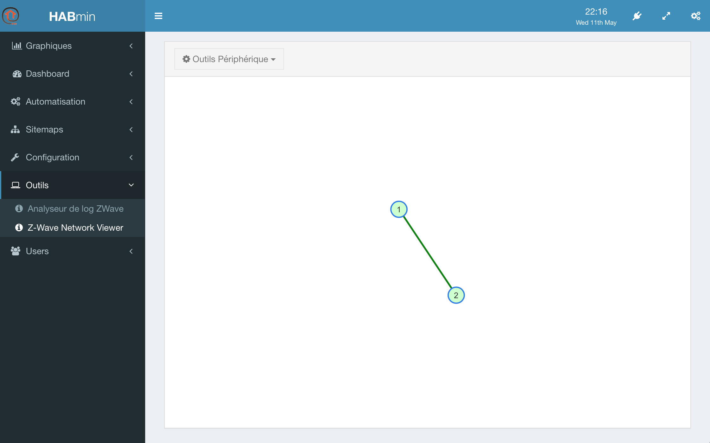

# Configuring a Thing
You can access to the Thing configuration by clicking on *Configuration*, *Thing Configuration* in the right menu.

The Thing configuration display has 6 panels.

## Overview configuration panel

This panel contains the following information:
* The label giving you the model name of the *Thing*, read-only,
* The overview, giving a description of the *Thing*, coming from the ZWave database, read-only,
* A set of controls, one per actionable *item* that has been created. You can play with the control in order to check that your device is correctly working. The name and the identifier of the *item* are read-only.

> 
The name of the item can be modified in the channels panel.

## The properties panel

The properties panel presents the Label of the Thing.

You can change the label according, for example, the naming convention that we presented in the introduction.

## Configuration parameters panel

This panel presents the configuration parameters of the device

The content of this panel depends on the device model.

The use of these parameters are described in the user's manual of the device itself.

## Association group panel

<<<< TO BE COMPLETED >>>>

## Device configuration panel

<<<< TO BE COMPLETED >>>>

## Channels panel

This panel is the key panel to configure the *Items*, as they are linked to chanels*

