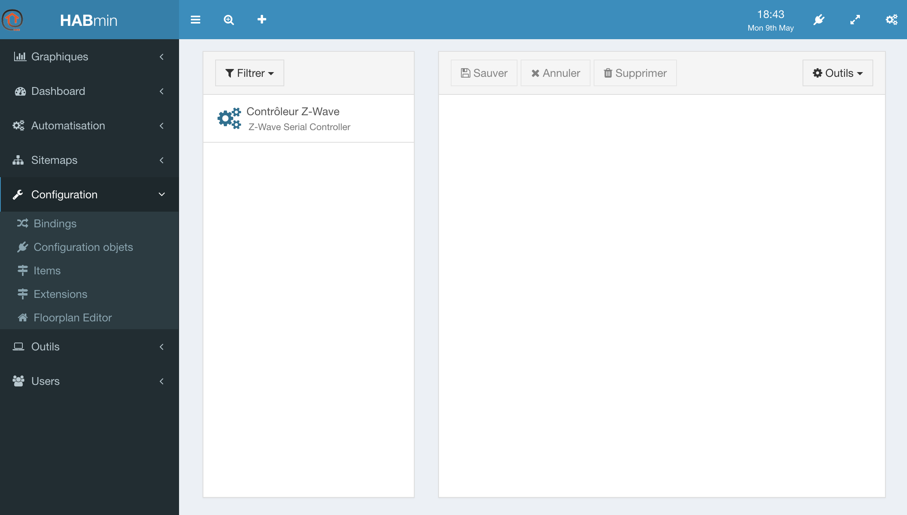
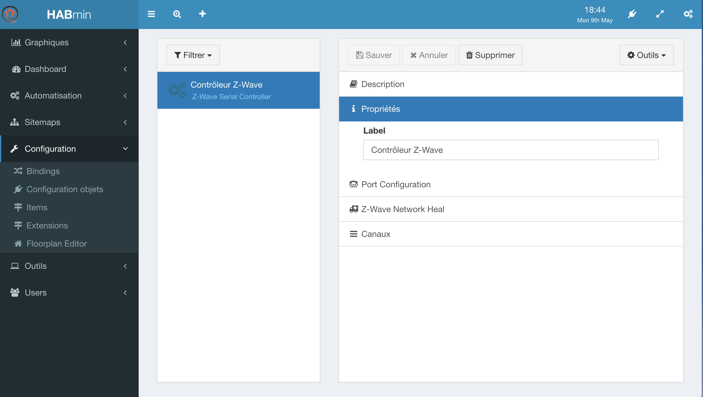
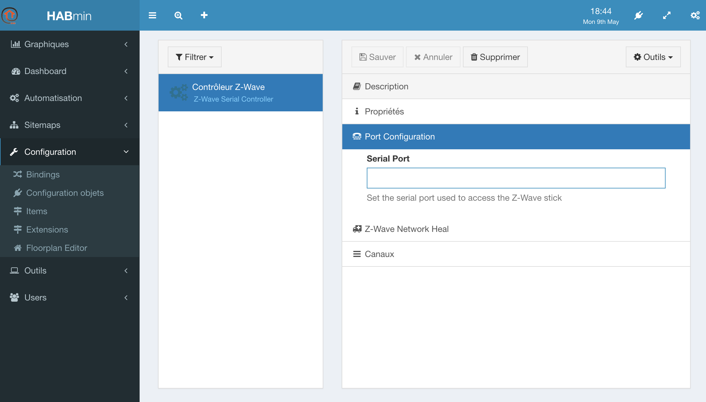

# Connecting to the Z-Wave controller

## What is the controller ?

The Z-wave controller is the masterpiece of the Z-Wave network.

The Z-Wave bindings relies on it to dialog with the Z-Wave devices. Adding it is made from the __HABmin__.

Working with the Z-Wave devices will be done in __HABmin__.


## Adding the Thing

* From OpenHab welcome screen, choose the __HABmin__ tile.
* On the left menu, click on __Configuration__ and __Things configuration__.
* The controller must be added manually. Click on the __+__ sign, at the top of the screen.


* In the following screen, choose __Z-Wave Binding__ :


* You can then select : __Z-Wave Serial Controller__ :


* In the following screen, you can change the __label__ value to the name you want to give to the controller.


* Click on save, and you are ready to configure it.

> When click on __Save__, nothing change on the screen, but the log file confirms that a next thing has been defined.
> The log files looks like:
```
2016-05-09 18:53:33.987 [INFO ] [smarthome.event.ThingAddedEvent     ] - Thing 'zwave:serial_zstick:154966faddf' has been added.
2016-05-09 18:53:33.990 [ERROR] [ing.zwave.handler.ZWaveSerialHandler] - ZWave port is not set.
2016-05-09 18:53:33.990 [INFO ] [me.event.ThingStatusInfoChangedEvent] - 'zwave:serial_zstick:154966faddf' changed from UNINITIALIZED to INITIALIZING
```
> So, do not panic and continue

## Configuring the port

* On the left menu, click again on  __Things configuration__, the controller is now in the list :



* Click on the Controller
* The following screen allows you to configure the Thing.



* Click on Port configuration



The main parameter to find is the Port Configuration.


