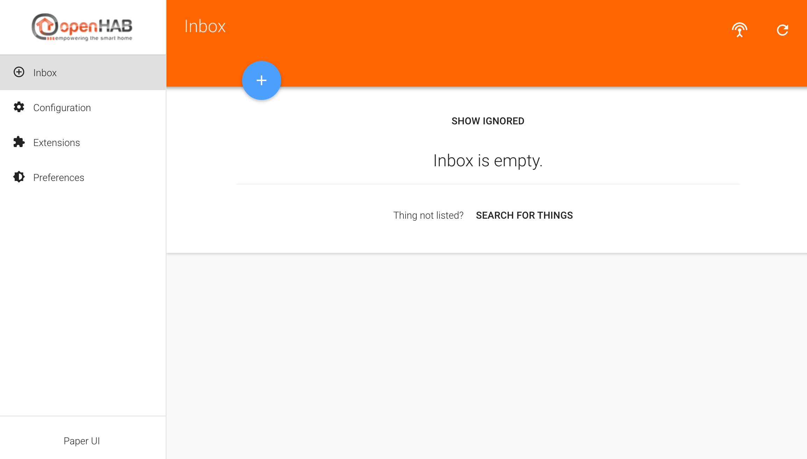
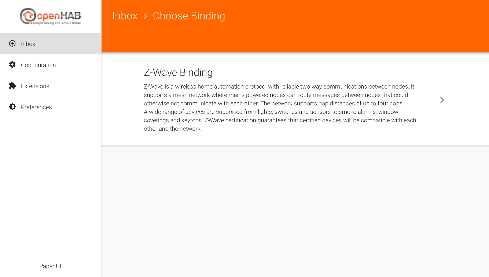
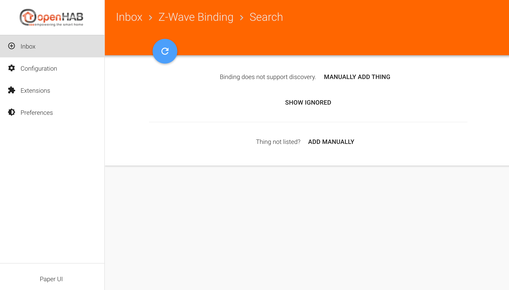
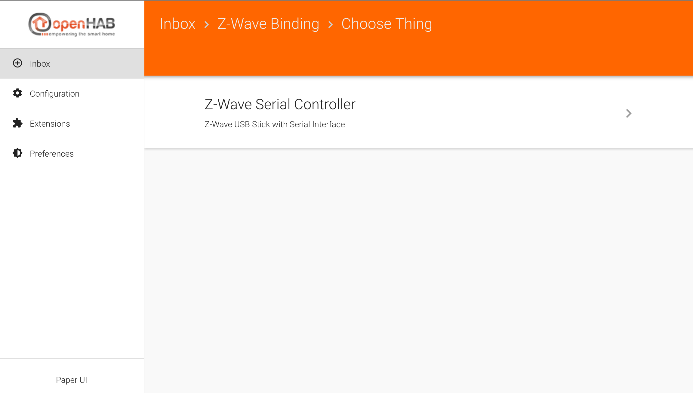
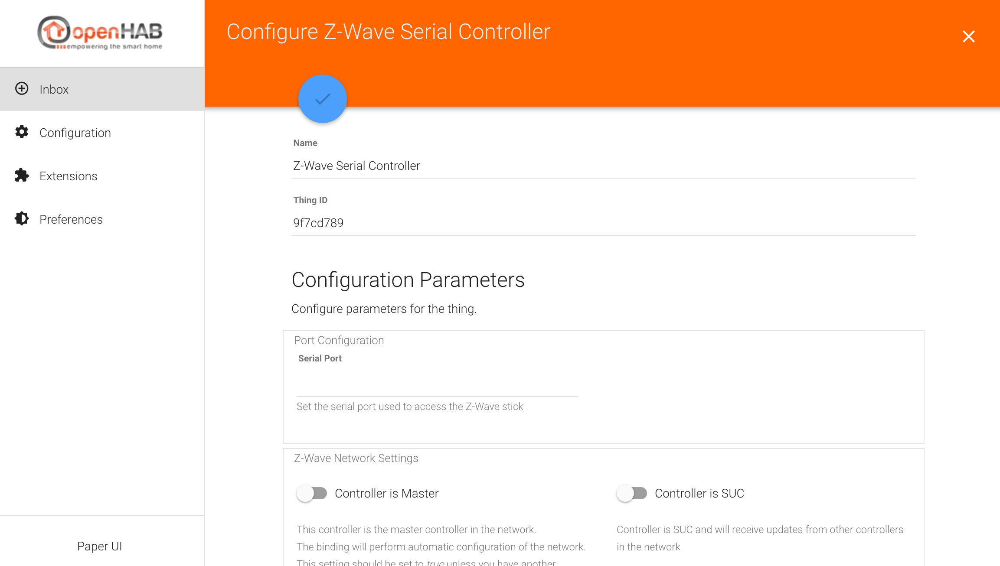

# Connecting to the Z-Wave controller

## What is the controller ?

The Z-wave controller is the masterpiece of the Z-Wave network.

The Z-Wave bindings relies on it to dialog with the Z-Wave devices. Adding it is made from the __Paper UI__.

Working with the Z-Wave devices will be done in __HABmin__.

## Adding the Thing

* From OpenHab welcome screen, choose the __Paper UI__.
* Click on Inbox :

* The controller must be added manually. Click on the blue +.

* In the following screen, choose __Z-Wave Binding__ :

* In the following screen, choose __Manually Add things__ :
 

* You can then select : "Z-Wave Serial Controller" :

* And you are ready to configure it.

## Configuring it

* The following screen allows you to configure the Thing.

### Configuring the port

The main parameter to find is the Port Configuration.

