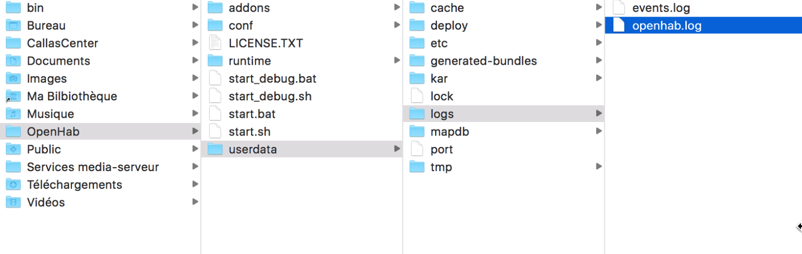
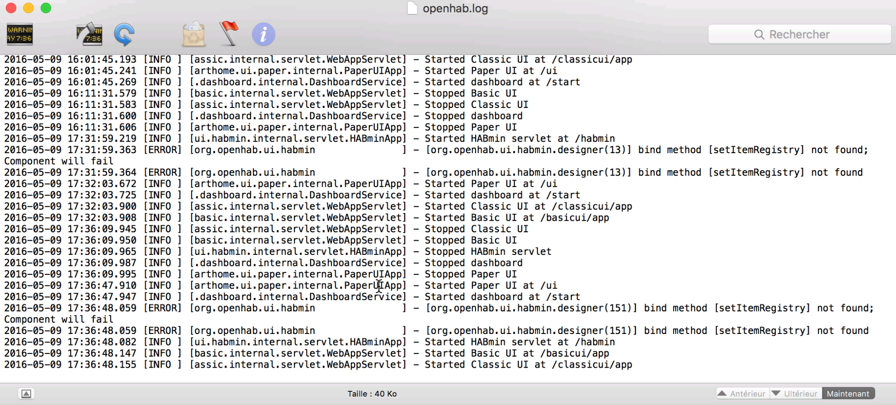

# Looking to the logs

While using OpenHab, we will need to look the the logs generated by OpenHab.

Two log files are going to interest us.

To find them :
* open the finder,
* navigate to your home folder,
* navigate inside the OpenHab folder,
* navigate inside the userdate folder,
* navigate inside the logs folder

* Inside the logs folder, double-click on the `openhab.log` file. The file will be displayed inside the console application.

The console will display the messages as soon as they will be logged. Keep this window somewhere in order to take a look inside when it is needed.
