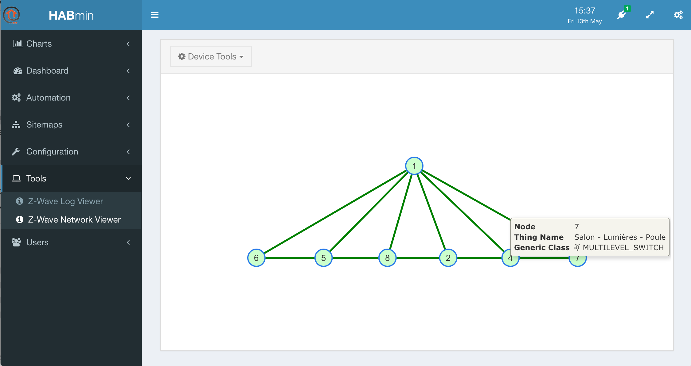

# Other tools of Habmin

## The Z-Wave network viewer

In the left menu, click on *Tools*, *Z-Wave network viewer*.

The viewer display a graph of the network. You can have information about the node by clicking on it.

