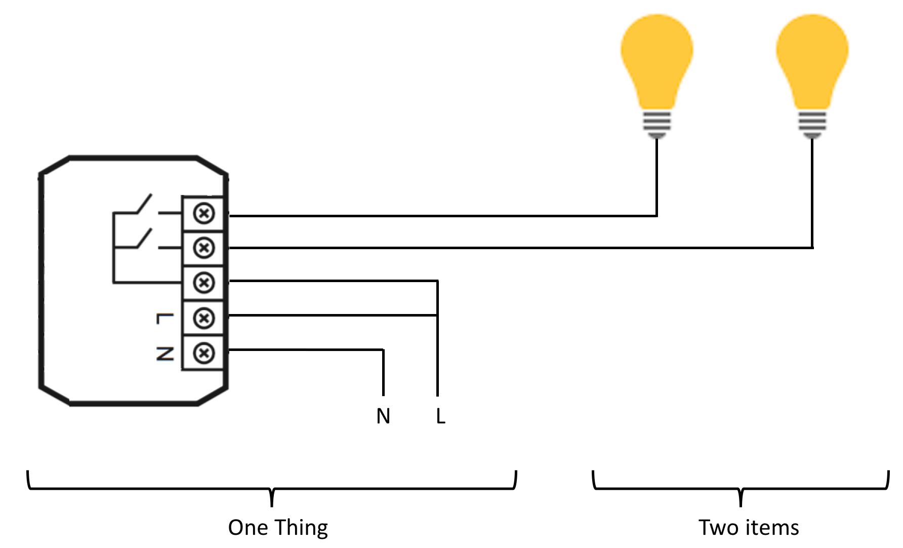
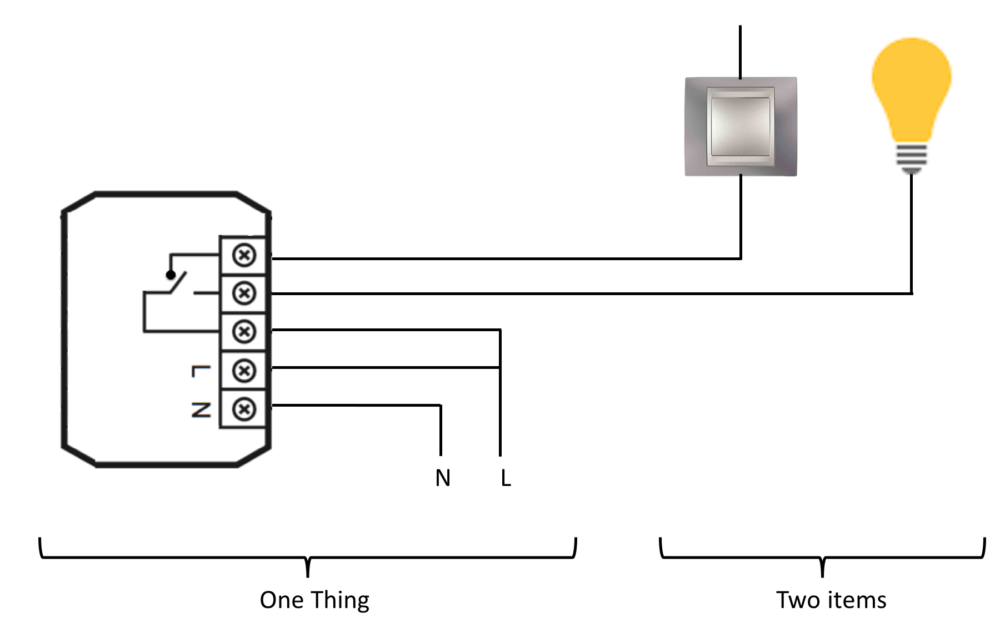
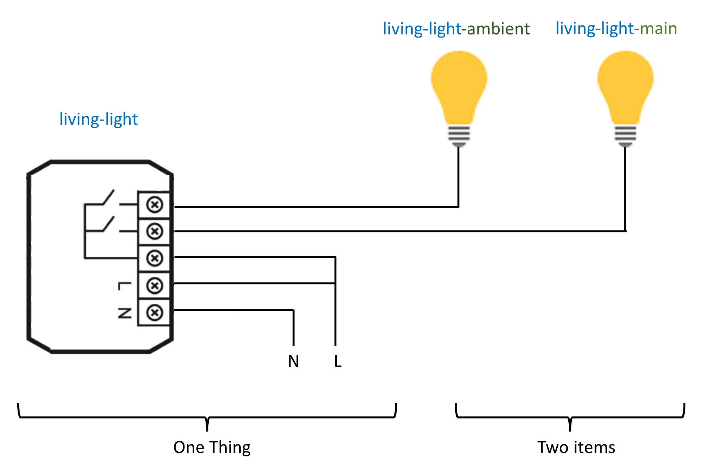

# Things, items and Co

OpenHab 2 introduces two levels to describe the devices : things and items.

The following illustrates the difference between them.

## One device to manage two lights

This corresponds to one double-switch device.

## One device to manage one light and a switch

This corresponds to a device with one switch, with an entry for a mechanical switch.

## Naming convention

Naming things and items in a consistent way is important in order to help maintaining the system from time to time.

Here is the one I propose, based on the way I think to the devices when I need to find them:

* first of all, I am working in a room - for example, the living-room that we will call *living*
* in this room, I have a thing that allows to switch two lights - lets call this *light*
* the two items are a main light and an ambient light - let's call them *main* and * ambient

So:
* the thing will be named *living-light*
* the main light will be the item named *living-light-main*
* the ambient light will be the item named *living-light-ambient*

